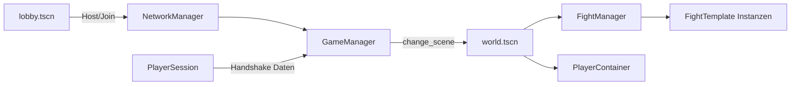

# NewTestProject

2D-Multiplayer-Prototyp in **Godot 4.7**: Lobby, gemeinsame Welt und instanzierte Grid-Kämpfe mit Hex-Pfadfindung (`AStar2D`).

**Status:** Early prototype — in aktiver Entwicklung.

---

## Features

| Bereich | Beschreibung |
|--------|----------------|
| Multiplayer | ENet (Host/Join), Port `7000`, Standard-IP `127.0.0.1` — siehe `global/NetworkManager.gd` |
| Spielablauf | Lobby → Welt; bei Verbindungsverlust zurück ins Menü — `global/GameManager.gd` |
| Spieler | Spawn pro Peer-ID, Multiplayer-Authority, JSON-Savegames — `global/PlayerSession.gd`, `scripts/world.gd` |
| Open World | WASD Direct-Movement — `scripts/movement/direct_movement.gd` |
| Kämpfe | Start / Join / Leave über Fight-Menü, Host-Autorität, Sync für spät Beitretende — `scripts/fight_manager.gd` |
| Kampf-Modus | Hex-Grid, Linksklick-Pfad, Grid-Movement — `scripts/fights/grid_manager.gd`, `scripts/movement/grid_movement.gd` |
| Bewegung | `MovementController` mit Modi PLAYER / PATH / GRID — `scripts/movement/movement_controller.gd` |

### Noch minimal / geplant

- **PATH-Movement** in der Open World ist ein Platzhalter (`scripts/movement/path_movement.gd`).
- **Savegames:** Die Lobby lädt beim Start automatisch das erste verfügbare Save (keine Auswahl-UI).
- **Hauptszenen:** Einstieg über `scene/lobby.tscn`; die spielbare Welt ist `scene/world.tscn`. `scene/testWorld.tscn` dient als Test-/Alt-Szene.
- **Export:** Kein Export-Preset im Repository — Builds sind noch nicht eingerichtet.

---

## Tech-Stack

- **Engine:** Godot 4.7 (Feature: Forward Plus)
- **Spiel-Dimension:** 2D (`CharacterBody2D`, `Node2D`, `Camera2D`, Sprites)
- **Physik (Projekt-Setting):** Jolt in `project.godot` — relevant vor allem für 3D-Export-Defaults; der Laufzeitcode ist 2D
- **Netzwerk:** `ENetMultiplayerPeer`, RPCs im `FightManager`
- **Grafik:** 2D-Sprite-Layer (`scene/character_visuals.tscn`)

---

## Architektur

**Autoloads:** `NetworkManager`, `GameManager`, `PlayerSession`



- **World** (`scripts/world.gd`): Character-Spawn, Fight-Menü, Ingame-Lobby umschalten.
- **FightTemplate** (`scripts/fights/fight_template.gd`): Grid, Battle-Characters; Sichtbarkeit nur für Kampfteilnehmer.

---

## Projektstruktur

```
global/          Autoloads (Netzwerk, Szenenwechsel, Saves)
scripts/         Lobby, World, Movement, States, Fights, UI
scene/           lobby, world, character_template, fight/, ui/
data/            Platzhalter (characters, items, enemies, …)
assets/          sprites, audio, fonts (größtenteils .gitkeep)
```

Nach dem Klonen: Godot erzeugt lokal den Ordner `.godot/` (in `.gitignore`).

---

## Voraussetzungen & Start

1. [Godot 4.7](https://godotengine.org/download/) installieren (Editor oder Steam).
2. Projektordner mit `project.godot` im Godot Project Manager öffnen.
3. **F5** oder Play — startet die Lobby (`scene/lobby.tscn`).

### Multiplayer lokal testen

1. Zwei Editor-Instanzen (oder Editor + exportierte Binary) starten.
2. Instanz A: **Start** (Host).
3. Instanz B: **Join** (Client).
4. Client-IP bei Bedarf in `global/NetworkManager.gd` (`DEFAULT_IP`) anpassen.

### Troubleshooting (Linux)

Unter **KDE Wayland** kann die **Steam-Version** (nur X11-Binary) hängen oder kein Fenster zeigen. Typische Workarounds: Plasma (X11) testen, Godot direkt von godotengine.org nutzen, oder `--rendering-driver opengl3` / `--verbose` zur Diagnose.

---

## Steuerung

| Aktion | Eingabe |
|--------|---------|
| Bewegen (Open World) | W / A / S / D |
| Grid-Pfad setzen (Kampf) | Linksklick |
| Ingame-Lobby ein/aus | Escape (`Menu`) |
| Fight-Menü | F (`action_button`) |

---

## Entwicklung

- GDScript mit Typen; `class_name` wo sinnvoll (z. B. `GridManager`, `MovementController`).
- Multiplayer: Character-Authority über Peer-ID (`node.name` = Peer-ID).
- States unter `scripts/states/` (State-Machine am Character).

---

## Roadmap (Auszug)

- PATH-Movement für die Open World implementieren
- Kampf-Gameplay über reine Grid-Bewegung hinaus
- Savegame-Auswahl in der Lobby
- Content und Daten unter `data/`

---

## Lizenz

Noch nicht festgelegt.
